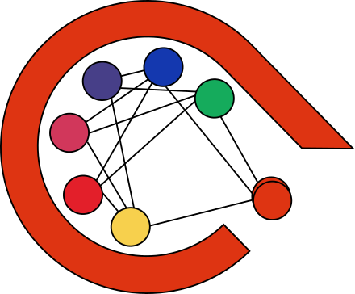

<p align="center"></p>

# ART - Actually Robust Training framework


----

**ART** is a Python library that teaches good practices when training deep neural networks with [PyTorch](https://pytorch.org/). It is inspired by Andrej Karpathy's blog post [“A Recipe for Training Neural Networks”](https://karpathy.github.io/2019/04/25/recipe/). ART encourages the user to train DNNs through a series of steps that ensure the correctness and robustness of their training pipeline. The steps implemented using ART can be viewed not only as guidance for early adepts of deep learning but also as a project template and checklist for more advanced users.

To get the most out of ART, you should have a basic knowledge of (or eagerness to learn):
- Python: https://www.learnpython.org/
- Machine learning: https://www.coursera.org/learn/machine-learning
- PyTorch: https://pytorch.org/tutorials/
- PyTorch Lightning: https://lightning.ai/docs/pytorch/stable/levels/core_skills.html

**Table of contents:**
- [ART - Actually Robust Training framework](#art---actually-robust-training-framework)
  - [Installation](#installation)
  - [Quickstart](#quickstart)
    - [Steps](#steps)
    - [Adding checks](#adding-checks)
    - [Debug your Neural Network](#debug-your-neural-network)
    - [Get control over what is being calculated](#get-control-over-what-is-being-calculated)
  - [Project creation](#project-creation)
  - [Dashboard](#dashboard)
  - [Tutorials](#tutorials)
  - [Contributing](#contributing)

## Installation
To get started, install ART package using:
```sh
pip install art-training
```

## Quickstart

### Steps
The basic idea behind ART is to split your deep learning pipeline into a series of _steps_:
```python
    from art.project import ArtProject
    from art.steps import CheckLossOnInit, Overfit, OverfitOneBatch
    
    datamodule = YourLightningDataModule()
    model_class = YourLightningModule

    project = ArtProject(name="quickstart", datamodule=datamodule)

    project.add_step(CheckLossOnInit(model_class))
    project.add_step(OverfitOneBatch(model_class))
    project.add_step(Overfit(model_class))

    project.run_all()
```

As a result, if you logged any metrics with self.log, you should observe something like this:

```
Summary:
Step: Check Loss On Init, Model: YourLightningModule, Passed: True. Results:
         loss-valid: 16.067102432250977
         accuracy-train: 0.75
Step: Overfit One Batch, Model: YourLightningModule, Passed: True. Results:
         loss-train: 0.00035009183920919895
         accuracy-train: 0.800000011920929
Step: Overfit, Model: YourLightningModule, Passed: True. Results:
         loss-train: 2.1859991550445557
         accuracy-train: 0.75
         loss-valid: 3.5187878608703613
```

[Explore all available Steps](not-existing-link)

### Adding checks
Ideally, each step should be accompanied by a set of _checks_. ART will not move to the next step without passing checks from previous steps.

```python
    from art.steps import CheckLossOnInit, Overfit, OverfitOneBatch

    datamodule = YourLightningDataModule()
    model_class = YourLightningModule

    project = ArtProject(name="quickstart", datamodule=datamodule)

    # Let's assume we are working on a typical classification problem
    NUM_CLASSES = 10
    EXPECTED_LOSS = -math.log(1 / NUM_CLASSES) # 2.3

    project.add_step(
        CheckLossOnInit(model_class),
        #You must know logged metric names
        checks=[CheckScoreCloseTo("loss-valid", EXPECTED_LOSS, rel_tol=0.01)],
    )
    project.add_step(
        OverfitOneBatch(model_class),
        checks=[CheckScoreLessThan("loss-train", 0.001)],
    )
    project.add_step(
        Overfit(model_class),
        checks=[CheckScoreLessThan("accuracy-train", 0.9)],
    )

    project.run_all()
```

This time, depending on your scores, you may observe something like this:

```
Check failed for step: Check Loss On Init. Reason: Score 16.067102432250977 is not equal to 2.3
Summary:
Step: Check Loss On Init, Model: YourLightningModule, Passed: False. Results:
         loss-valid: 16.067102432250977
         accuracy-train: 0.75
```

### Debug your Neural Network
Track network evolution, gradient values, and save images by decorating your functions
```python
    from art.decorators import BatchSaver, art_decorate

    datamodule = YourLightningDataModule()
    model_class = YourLightningModule
    art_decorate([(model_class, "forward")], BatchSaver())

    project = ArtProject(name="quickstart", datamodule=datamodule)
    # For this to work we should allow providing empty checks. And just print a warning... man use checks.
    project.add_step(CheckLossOnInit(model_class))
    project.run_all()

```

### Get control over what is being calculated
For some problems, metric calculation can be quite expensive. By utilizing the `MetricCalculator` class, you can control what is being calculated. Additionally, metric names and logging are handled automatically:
```python
    from art.metrics import MetricCalculator, SkippedMetric

    datamodule = YourLightningDataModule()
    # from art.core import ArtModule
    # from art.utils.enums import PREDICTION, TARGET
    # YourLightningModule(L.LightningModule) -> YourArtModule(ArtModule)
    #
    # Now you can Use YourArtModule.compute_metrics({PREDICTION: ..., TARGET: ...}) -> Dict[str, float]
    # This will calculate and log metrics with an appropriate name for you. Additionally, you can now skip expensive metrics calculations
    model_class = YourArtModule

    # Let's assume we work on a typical classification problem
    NUM_CLASSES = 10
    EXPECTED_LOSS = -math.log(1 / NUM_CLASSES)

    # Remove metrics definition from model and put them here
    expensive_metric = Accuracy(task="multiclass", num_classes=NUM_CLASSES)
    loss_fn = nn.CrossEntropyLoss()
    project = ArtProject(name="quickstart", datamodule=datamodule)

    metric_calculator = MetricCalculator(project, [expensive_metric, loss_fn])

    project.add_step(
        CheckLossOnInit(model_class),
        # You don't have to hardcode this names
        checks=[CheckScoreCloseTo(loss_fn, EXPECTED_LOSS, rel_tol=0.01)],
        # expensive_metric won't be calculated during this step
        skipped_metrics=[SkippedMetric(expensive_metric)],
    )
    project.add_step(
        OverfitOneBatch(model_class),
        checks=[CheckScoreLessThan(loss_fn, 0.1)],
        skipped_metrics=[SkippedMetric(expensive_metric)],
    )
    project.add_step(
        Overfit(model_class),
        checks=[CheckScoreGreaterThan(expensive_metric, 0.9)],
    )

    project.run_all(metric_calculator=metric_calculator)
```

In summary:
- You still use **pure PyTorch and Lightning**.
- You don't lose any **flexibility**.
- You keep your experiments **organized**.
- You follow **best practices**.
- You make your model **easier to debug**.
- You increase experiment **reproducibility**.

If you want to use all features from ART and create your new Deep Learning Project following good practices check out the [tutorials](#tutorials).

## Project creation
To get the most out of ART, we encourage you to create a new folder for your project using the CLI tool:
```sh
python -m art.cli create-project my_project_name
```

This will create a new folder called `my_project_name` with a basic structure for your project. To learn more about ART, for more details we encourage you to read the [documentation](https://actually-robust-training.readthedocs.io/en/latest/) or go through the [tutorials](#tutorials)!

## Dashboard
After you run some steps, you can compare their execution in the dashboard. To use the dashboard, first install required dependencies:
```sh
pip install art-training[dashboard]
```
and run the following command in the directory of your project (the directory with a folder called art_checkpoints).
```sh
python -m art.cli run-dashboard
```
Optionally you can use the `--experiment-folder` switch to pass the path to the folder. For more info, use the `--help` switch.

## Tutorials
1. A showcase of ART's features. To check it out, type:
```sh
python -m art.cli get-started
```
and launch tutorial.ipynb

After running all cells run the dashboard with:
```sh
python -m art.cli run-dashboard
```

2. A tutorial showing how to use ART for transfer learning in an NLP task.
```sh
python -m art.cli bert-transfer-learning-tutorial
```

## Contributing
We welcome contributions to ART! Please check out our [contributing guide](https://github.com/SebChw/art/wiki/Contributing)
