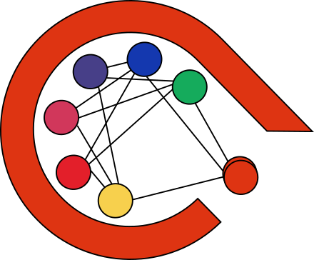

<p align="center"></p>

<p align="center">
    <b>ART - Actually Robust Training</b>
    <br>
    <em>Robust, explainable, and easy to debug deep learning experiments.</em>
</p>
<p align="center">


</p>

----

**ART** is a Python library that teaches good practices when training deep neural networks with [PyTorch](https://pytorch.org/). It is inspired by Andrej Karpathy's blog post [“A Recipe for Training Neural Networks”](https://karpathy.github.io/2019/04/25/recipe/). ART encourages the user to train DNNs through a series of steps that ensure the correctness and robustness of their training pipeline. The steps implemented using ART can be viewed not only as guidance for early adepts of deep learning but also as a project template and checklist for more advanced users.

To get the most out of ART, you should have a basic knowledge of (or eagerness to learn):
- Python: https://www.learnpython.org/
- Machine learning: https://www.coursera.org/learn/machine-learning
- PyTorch: https://pytorch.org/tutorials/
- PyTorch Lightning: https://lightning.ai/docs/pytorch/stable/levels/core_skills.html

**Table of contents:**
- [Installation](#installation)
- [Quickstart](#quickstart)
- [Project creation](#project-creation)
- [Dashboard](#dashboard)
- [Tutorials](#tutorials)
- [API Cheatsheet](#api-cheatsheet)
- [Contributing](#contributing)

## Installation
To get started, install ART package using:
```sh
pip install art-training
```

## Quickstart

1. The basic idea behind ART is to split your deep learning pipeline into a series of _steps_. 
2. Each step should be accompanied by a set of _checks_. ART will not move to the next step without passing checks from previous steps.

```python
import math
import torch.nn as nn
from torchmetrics import Accuracy
from art.checks import CheckScoreCloseTo, CheckScoreGreaterThan, CheckScoreLessThan
from art.metrics import SkippedMetric
from art.project import ArtProject
from art.steps import CheckLossOnInit, Overfit, OverfitOneBatch
from art.utils.quickstart import ArtModuleExample, LightningDataModuleExample

# Initialize the datamodule, and indicate the model class
datamodule = LightningDataModuleExample()
model_class = ArtModuleExample

# Define metrics and loss functions to be calculated within the project
metric = Accuracy(task="multiclass", num_classes=datamodule.n_classes)
loss_fn = nn.CrossEntropyLoss()

# Create an ART project and register defined metrics
project = ArtProject(name="quickstart", datamodule=datamodule)
project.register_metrics([metric, loss_fn])

# Add steps to the project
EXPECTED_LOSS = -math.log(1 / datamodule.n_classes)
project.add_step(
    CheckLossOnInit(model_class),
    checks=[CheckScoreCloseTo(loss_fn, EXPECTED_LOSS, rel_tol=0.01)],
    skipped_metrics=[SkippedMetric(metric)],
)
project.add_step(
    OverfitOneBatch(model_class, number_of_steps=100),
    checks=[CheckScoreLessThan(loss_fn, 0.1)],
    skipped_metrics=[SkippedMetric(metric)],
)
project.add_step(
    Overfit(model_class, max_epochs=10),
    checks=[CheckScoreGreaterThan(metric, 0.9)],
)

# Run your project
project.run_all()
```

As a result, you should observe something like this:
```
    Check failed for step: Overfit. Reason: Score 0.7900000214576721 is not greater than 0.9
    Summary:
    Step: Check Loss On Init, Model: ArtModuleExample, Passed: True. Results:
            CrossEntropyLoss-validate: 2.299098491668701
    Step: Overfit One Batch, Model: ArtModuleExample, Passed: True. Results:
            CrossEntropyLoss-train: 0.03459629788994789
    Step: Overfit, Model: ArtModuleExample, Passed: False. Results:
            MulticlassAccuracy-train: 0.7900000214576721
            CrossEntropyLoss-train: 0.5287203788757324
            MulticlassAccuracy-validate: 0.699999988079071
            CrossEntropyLoss-validate: 0.8762148022651672
```

Finally, track your progress with the dashboard:

```sh
python -m art.cli run-dashboard
```

<p align="center"></p>

In summary:
- You still use **pure PyTorch and Lightning**.
- You don't lose any **flexibility**.
- You keep your experiments **organized**.
- You follow **best practices**.
- You make your model **easier to debug**.
- You increase experiment **reproducibility**.

If you want to use all features from ART and create your new Deep Learning Project following good practices check out the [tutorials](#tutorials).

## Project creation
To get the most out of ART, we encourage you to create a new folder for your project using the CLI tool:
```sh
python -m art.cli create-project my_project_name
```

This will create a new folder called `my_project_name` with a basic structure for your project. To learn more about ART, for more details we encourage you to read the [documentation](https://actually-robust-training.readthedocs.io/en/latest/) or go through the [tutorials](#tutorials)!

## Dashboard
After you run some steps, you can compare their execution in the dashboard. To use the dashboard, first install required dependencies:
```sh
pip install art-training[dashboard]
```
and run the following command in the directory of your project (the directory with a folder called art_checkpoints).
```sh
python -m art.cli run-dashboard
```
Optionally you can use the `--experiment-folder` switch to pass the path to the folder. For more info, use the `--help` switch.

## Tutorials
1. A showcase of ART's features. To check it out, type:
```sh
python -m art.cli get-started
```
and launch tutorial.ipynb

After running all cells run the dashboard with:
```sh
python -m art.cli run-dashboard
```

2. A tutorial showing how to use ART for transfer learning in an NLP task.
```sh
python -m art.cli bert-transfer-learning-tutorial

```
3. A tutorial showing how to use ART for regularization
```sh
python -m art.cli regularization-tutorial
```

The source code of tutorials and ART template is available at the separate branches of [ART-Templates repo](https://github.com/SebChw/ART-Templates)

## API Cheatsheet
- [**ArtModule**](https://actually-robust-training.readthedocs.io/en/latest/apidocs/art.html#art.core.ArtModule): While exploring different models, ART provides a unified way to define and train models. ART uses `ArtModule` that inherits from PyTorch Lightning's LightningModule. ArtModules are designed to be easily configurable and to support different model architectures.
- [**Step**](https://actually-robust-training.readthedocs.io/en/latest/apidocs/art.html#art.steps.Step): Unitary process that takes you closer to your final goal - good Deep Learning model. **In this tutorial we present you steps that were inspired by Andrej Karpathy's** [Recipe for Training Neural Networks](http://karpathy.github.io/2019/04/25/recipe/):
    1. [EvaluateBaseline](https://actually-robust-training.readthedocs.io/en/latest/apidocs/art.html#art.steps.EvaluateBaseline) - before starting a new project it is good to know with whom we compete.
    2. [CheckLossOnInit](https://actually-robust-training.readthedocs.io/en/latest/apidocs/art.html#art.steps.CheckLossOnInit) - Checking Loss right after network initialization is a very good debug step
    3. [OverfitOneBatch](https://actually-robust-training.readthedocs.io/en/latest/apidocs/art.html#art.steps.OverfitOneBatch) - If you can't Overfit a single batch, it is very unlikely that your network will work any good.
    4. [Overfit](https://actually-robust-training.readthedocs.io/en/latest/apidocs/art.html#art.steps.Overfit) - By reducing the wanted metric on the training set you can observe `theoretically` achievable minimum if this value doesn't satisfy you it is very unlikely it will be better on the test set.
    5. [Regularize](https://actually-robust-training.readthedocs.io/en/latest/apidocs/art.html#art.steps.Regularize) - Usually gap between training and validation score is quite big and we need to introduce regularization techniques to achieve satisfactory validation accuracy.
    6. [TransferLearning](https://actually-robust-training.readthedocs.io/en/latest/apidocs/art.html#art.steps.TransferLearning) - If you have a pre-trained model on a similar task, you can use it to initialize your network. In this step, you can perform two types of transfer learning:
        - Freeze - Freeze all layers except the last one and train only the last layer.
        - Finetune - Unfreeze all layers and train the whole network.
- [**MetricCalculator**](https://actually-robust-training.readthedocs.io/en/latest/apidocs/art.html#art.metrics.MetricCalculator): To make you write less code we implemented `MetricCalculator`, a special object that takes care of metric calculation between all steps. The only thing you have to do is to `register` the metrics that you want to compute.
- [**Check**](https://actually-robust-training.readthedocs.io/en/latest/apidocs/art.html#art.checks.Check): For every step you must pass a list of `Check` objects that must be fulfilled for the step to be passed. You may encounter checks like [`CheckScoreExists`](https://actually-robust-training.readthedocs.io/en/latest/apidocs/art.html#art.checks.CheckScoreExists) or [`CheckCloseTo`](https://actually-robust-training.readthedocs.io/en/latest/apidocs/art.html#art.checks.CheckScoreCloseTo). Every check takes at least 3 arguments:
  - Metric, which value at the end of a step will be checked. This may be the `nn.CrossEntropyLoss` object.
  - Stage, During different steps you'll be interested in performance at either Training or Validation. You must pass the information about this too.
  - value, wanted the value of the check
- [**Art Project**](https://actually-robust-training.readthedocs.io/en/latest/apidocs/art.html#art.project.ArtProject): Every project consists of many steps. You can add them to `ArtProject` which is responsible for running them. `ArtProject` also saves metadata about your steps that you can later see in `Dashboard`. 
- **Dataset**: Each Project is supposed to deal with one dataset. ART supports every LightningDataModule from PyTorch Lightning and every torch Dataset with its dataloader.
- **Dashboard**: For every project you can run a dashboard that will show you the progress of your project. You can run it with the `python -m art.cli run-dashboard` command. You can also run it with the `--experiment-folder` switch to pass the path to the folder. For more info, use the `--help` switch.


## Contributing
We welcome contributions to ART! Please check out our [contributing guide](https://github.com/SebChw/art/wiki/Contributing)


